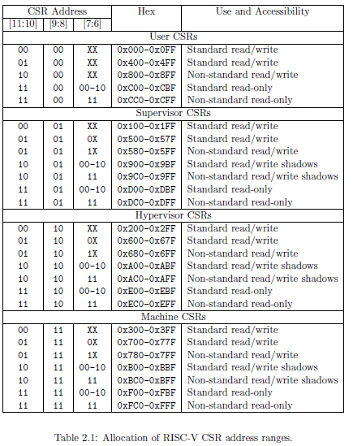

## 2.2 CSRs 地址映射惯例

标准RISC-V ISA 留出 12位的编码空间（csr[11:0]）分配给最多 4096个 CSRs。按照惯例，CSR地址的高 4位（csr[11:8]）用来编码对应如表 2.1所示的特权级别下 CSRs 的读写访问权限。最高两位（csr[11:10]）表明寄存器是可读写的（00,01 或是10）还是只读（11）。接下来的两位（csr[9:8]）表明可以访问CSR的最低特权级别（00 是用户，01 是管理员）。

尝试访问不存在的 CSR 会引起非法指令异常。没有在适当的特权级别访问一个 CSR 或是写入一个只读寄存器同样会引起非法指令异常。可读/写可能会包含一些比特位是只读的，这样的话，会忽略对这些只读比特位的写入。

表 2.1 也指出了在标准和非标准的使用之间分配 CSR 地址的惯例。保留给非标准使用的CSR地址将不会被将来的标准扩展重新定义。影子（shadow）地址提供了这样的读写地址：更高特权别能够修改寄存器，而更低特权级别只能读取内容。值得注意的是，如果一个特权级别已经分配了读/写的影子地址，那么任一更高的特权级别能够使用同样的CSR地址对同样的寄存器进行读/写。

  

