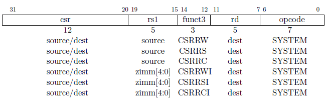

## 2.1 访问 CSRs 的指令

除了这个手册的第一卷所描述用户级的状态之外，一个实现得包括额外的 CSRs，所有特权级别的子集可以访问它们。下面的指令原子地读和修改 CSRs。操作 CSRs 的指令可能会产生副作用。

`CSRRW` （原子地读/写 CSR）指令原子地在 CSRs 和 整型寄存器之间交换。`CSRRW` 读取 CSR 的值，零扩展到 XLEN 位之后写入到整型寄存器 rd，把 rs1 的值写入 CSR。

`CSRRS` （原子地读/设置 CSR 中的比特位）指令读取CSR 的值，零扩展到 XLEN 位之后写入到整型寄存器 rd。整型寄存器 rs1 中的值会指定 CSR 中对应位置比特位的值置为1。在  rs1 中的高位会导致 CSR 对应的位，如果可写的话， 置 1。CSR 的其他比特位没有影响（尽管写入 CSRs 时会产生副作用）。

`CSRRC` （原子地读/清零 CSR 中的比特位）指令读取CSR 的值，零扩展到 XLEN 位之后写入到整型寄存器 rd。整型寄存器 rs1 中的值会指定 CSR 中对应位置比特位的值清零。在  rs1 中的高位会导致 CSR 对应的位，如果可写的话， 清零。CSR 的其他比特位没有影响。

对于 `CSRRS` 和`CSRRC` ，如果 rs1 = x0，那么该指令不会写入 CSR，也不会产生任何的副作用，而写入 CSR 可能会出现副作用。注意，如果 rs1 指定的寄存器保存的值是 0 而不是 x0，该指令仍会把未修改的值写回 CSR。

`CSRRWI`，`CSRRSI` 和 `CSRRCI` 变体分别类似于 `CSRRW` ，`CSRRS` 和 `CSRRC` 。除了不是用整型寄存器的值更新 CSR ，而是用编码在 rs1 字段的 5位立即数字段（zimm[4:0]）通过零扩展成 XLEN 位的值来更新 CSR。如果 zimm[4:0] 字段是 0，那么这些指令将不会对 CSR 进行写入，也就不会像其他对 CSR 进行写入那样导致任何副作用。

汇编器读取 CSR 的伪指令，`CSRR rd, csr` ，被编码成`CSRRS rd, csr, x0` 。汇编器写入CSR的伪指令，`CSRW csr, rs1` ，被编码成 `CSRRW x0, csr, rs1` ，而 `CSRWI csr, zimm` 被编码成 `CSRRWI x0, csr, zimm`。

更进一步地，用来对 CSR 的比特位进行置位和清零操作，且不需要原来旧的值时，使用这些汇编伪指令： `CSRS/CSRC csr, rs1` ， `CSRSI/CSRCI csr, zimm`。
