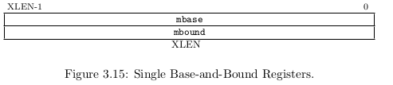

## 3.6 Base-and-Bound environments

这节描述 Mbb 虚拟环境，提供一个 base-and-bound 转换和保护策略。这里有两个 base-and-bound 变种：Mbb 和 Mbbid，取决于是单个 base-and-bound (Mbb) 还是取指和数据访问分开的 base-and-bound (Mbbid).这个简单的转换和保护策略的好处是复杂度低以及确定性的高性能，因为在运作过程中不会有 TLB 不命中。

### 3.6.1 Mbb: Single Base-and-Bound registers (mbase, mbound)

简单的 Mbb 系统有一个基址 `mbase` 和一个范围 `mbound` 寄存器。Mbb 通过向 `mstatus` 寄存器的 VM 字段写入 1 来开启。

base-and-bound 寄存器定义了一个连续的虚拟地址段，从虚拟地址 0开始，长度是`mbound`值指定的字节数。虚拟地址段映射到连续的物理地址段，从`mbase`寄存器指定的物理地址开始。

当 Mbb 生效时，所有更低的权限模式（U，S，H）取指地址和数据地址转换方式是：通过把 `mbase` 和 虚拟地址相加得到物理地址。同时，虚拟地址会和范围寄存器 `mbound` 的值进行比较。如果虚拟地址等于或大于 `mbound` 寄存器的虚拟地址上限，就会导致一个地址错误异常。

Machine-mode 在 Mbb 下取指和数据访问不会转换或检测，除了当 `mstatus`寄存器的 MPRV位置 1 时进行存数和取数。所以 machine-mode 有效地址被当作是物理地址。

### 3.6.2 Mbbid: Separate Instruction and Data Base-and-Bound registers

Mbbid 策略是把取指和数据访问的虚拟地址段分开，允许单个物理指令段由两个或更多的 user-level 虚拟地址空间共享，而单个的数据段被分配给每一个。Mbbid 通过向 `mstatus` 寄存器的 VM 字段写入 2 来开启。

`mibase` 和 `mibound` 寄存器分别定义了指令段的物理起始地址和长度，而 `mdbase` 和 `mdbound` 分别指定了数据段的物理起始地址和长度。

数据虚拟地址段从地址 0开始，而指令虚拟地址段从虚拟地址空间中间开始，地址的最高是 1，跟着 XLEN-1 个 0（例如，对于 32位地址空间系统是0x8000_0000）。级别更低的特权模式取指的虚拟地址首先被检测，确保最高位是 1；如果不是，引起异常。这个高位在随后的基址跟虚拟地址相加时或是检测范围时会当作 0。

提供 Mbbid 的系统必须也提供 Mbb。写入 CSR 地址对应的 mbase 也把同样的值写入 mibase 和 mdbase，写入 mbound 应该把同样的值写入 mibound 和 mdbound 来提供兼容的行为。读取 `mbase` 应该返回 `mdbase`的值，读取`mbound`应该返回 `mdbound` 的值。当 VM 被设置成 Mbb，取指不再检查虚拟地址的最高位，基址跟检查范围相加前不会把最高位重置为 0。
