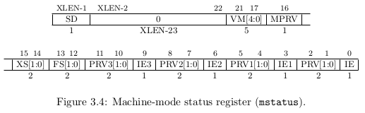

## 3.1 Machine-Level CSRs

> 译者：咧威（[＠colin4124](https://github.com/colin4124)）

除了这节描述的 machine-level CSRs 之外，M-mode 的代码能够访问所有权限级别比它低的 CSRs。

### 3.1.1 CPU ID Register `mcpuid`

`mcpuid` 寄存器是一个 XLEN 位的只读寄存器，存放关于 CPU 具体实现的能力信息。这个寄存器在任何实现里都是可读的，但可以返回值 0 来表示没有实现 CPU ID 这个功能，说明 CPU 的能力信息通过另外的非标准方式。

`Base` 字段表示的基本整型 ISA 如表 3.1 所示。对于支持多个 ISA 变种的实现， `Base` 字段总是描述支持范围最大的 (the widest) 那一个 ISA 变种，因为这是在重置时 machine-mode 进入的 ISA 模式。

`Extensions` 字段表示的是存在哪些标准扩展，每一位代表字母表里的一个字母（第 0 位用来编码是否支持扩展 "A"， 第 1 位是用来编码是否支持扩展 "B" ，直到第 25 位用来编码是否支持扩展将来的 "Z" 标准扩展）。用来编码 "I" 位的值为 1 时表示支持 RV32I，RV44I，RV128I 基本 ISAs，"E" 位的值为 1 时表示支持 RV32E。

"U", "S" 和 "H" 位的值为 1 时分别表示支持 user, supervisor 和 hypervisor 特权模式。

"X" 位的值为 1 时表示支持任一非标准的扩展。

### 3.1.2 Implementation ID Register `mimpid`

*mimpid* 若没有实现则返回 0。

16 位的 Source 字段分为两个类型：开源的和私有的实现。0x0001-0x7FFE 为开源项目而保留，0x8001-FFFE 保留给闭源的实现。0x7FFF 和 0xFFFF 保留给将来的扩展。0x8000 保留给尚未确定的源码，表示处于开发阶段， source ID 尚未确定。

Source 字段目前分配了的值如表 Table 3.2

`mimpid` 剩下的 XLEN-16 位可用来编码表示实现的设计细节，包括微体系结构类型和版本号。这个字段的编码格式留给源码的作者，but will be printed by standard tools as a hexadecimal string without leading zeros, so the Implementation value should be right-justified with subfields aligned on nibble boundaries to ease human readability.

`mimpid` 的值应该反应出 RISC-V 处理器本身的设计，而不是它外围的系统。需要单独的机制来编码外部系统的细节。

### 3.1.3 Hart ID Register `mhartid`

`mhartid` 寄存器是一个 XLEN 位的只读寄存器，保存正在运行代码的硬件线索 ID。这个寄存器在任何实现里都是可读的。 Hart ID 在多处理器系统里不必连续编号，但至少一个 hart 必须有值为 0 的 hart ID。

### 3.1.4 Machine Status Register  (mstatus)

`mstatus` 寄存器是一个 XLEN 位的读/写寄存器，编码格式如图 3.4。 `mstatus` 寄存器记录和控制 hart 当前的运作状态。在 H 和 S 特权级别的 ISA 里，hstatus 和 sstatus 分别是查看受限（restricted views）的 mstatus 寄存器。

### 3.1.5 Privilege and Global Interrupt-Enable Stack in mstatus register

`PRV[1:0]` 字段保存当前 hart 的特权模式，编码方式如表 1.1 所示。如果实现只提供 M-mode，那么这两个比特位就硬连线成二进制的 11。

`IE` 位表明当前特权模式是否开启中断（1=开启，0=禁止），主要是用于禁止中断来确保当前特权模式处理中断程序的原子性。当一个 hart 在一个给定的特权模式下运行，来自特权级别更高的中断总是允许的，而特权级别低的总是禁止。特权级别更高的代码能够在放弃对特权级别更低的控制之前，使用单独的每个中断使能位来禁止所选的中断。

为了支持嵌套的自陷，这里提供了 PRV 和 IE 栈，它们的深度跟所支持的特权模式是一一对应的，PRV0 是当前运作的特权模式 PRV（也是说，PRV0-PRVN 对应 N 个特权模式），除了当实现只支持 machine-mode，这种情况下栈的深度是 2，所有 PRV 字段都硬连线成 11。当发生自陷时，向左压栈，PRV 被设置成当前运行的处理自陷程序所在的特权模式，IE 置为 0。当自陷处理程序返回时（使用一个 `ERET` 指令），向右弹栈并把最左项（PRV N）置为支持的特权模式中基本最低的模式，并且相应的开启中断（也就是说，在处理自陷的程序返回时，若只有 M-mode，则 PRV1=M 且 IE1=1，而若是存在两个或多个模式，则 PRV N=U 且 IE N=1）。在正常运行情况下，这个栈里面的特权模式，从左到右（从最早到当前）的特权模式级别应该是单调递增的，也就是说，相邻的两个特权模式，左边的特权模式级别比右边的低。

### 3.1.6 Virtualization Management Field in mstatus Register

虚拟化管理（virtualization management）字段 VM[4:0] 表示当前使用的虚拟化策略（scheme），包括虚拟内存转换（translation）和保护。表 3.3 定义的虚拟化策略。只有 Mbare mode 是 RISC-V 硬件实现强制需要的。3.5-3.6 小节描述了 Mbare, Mbb 和 Mbbid 策略，而基于页面的（page-based）虚拟主存策略在后面的章节描述。

每个 VM 字段的设置定义了所有支持的特权级别的操作，有些 VM 设置的行为因硬件支持的特权级别的不同而不同。

Mbare 相当于没有内存管理或转换，所以不管哪个特权模式，所有的有效地址都被当作机器的物理地址。Mbare 是重置后进入的模式。

Mbb 是一个针对于至少有两个特权级别（U 和 M）系统的  架构。Mbb 适用于要求对于 user-mode 代码转换和保护开销低的系统，以及没有虚拟存储器分页需求的系统（支持交换）。不同的 Mbbid 提供单独的地址和数据片段来允许一个只执行的代码片段能在多个进程间共享。

Sv32 是适合于 RV32 系统的基于分页虚拟存储器架构，提供了 32位虚拟地址空间，用来支持现代 supervisor-level 操作系统，包括 Unix-based 系统。

Sv39 和 Sv48 适用于 RV64 系统的基于分页虚拟存储器架构，提供了 39位或 48位虚拟地址空间，用来支持现代 supervisor-level 操作系统，包括 Unix-based 系统。

Sv32，Sv39 和 Sv48 要求实现支持 M，S 和 U 特权级别。如果还有 H-mode，需要额外针对于 hypervisor-level 代码的操作来支持 supervisor-level 的虚拟机。用于支持虚拟机的 Hyperviso-mode 还没有定义。

### 3.1.7 Memory Privilege in mstatus Register

MPRV 位在执行存数和取数时会修改特权级别。当 ~MPRV=0~ ，转换和保护行为跟往常一样。当然 ~MPRV=1~ ，数据存储器地址被转换和保护，即使 PRV 被设置 PRV1 字段的当前值。指令地址转换和保护是不受影响的。

当出现异常时，MPRV 被置为 0。

### 3.1.8 Extension Context Status in mstatus Register

支持大量的扩展是 RISC-v 主要目标之一，因此我们定义一个标准接口允许不改变特权模式代码，尤其是特权模式的操作系统，支持任意用户模式状态的扩展。

FS[1:0] 和 XS[1:0] 读/写 字段用于降低这些代价：通过设置和跟踪浮点部件和任何其他用户模式扩展的当前状态来保存和恢复上下文。FS 字段编码浮点部件的状态，包括 CSR fcsr 和浮点数据寄存器 f0-f31，XS 字段编码任一额外用户模式扩展及关联的状态。SD 位是只读位用来概述是 FS 字段还是 XS 字段编码了脏状态，需要保存扩展的用户上下文到主存。在没有浮点部件的系统，FS 字段是硬连线到 0，在没有需要新状态的额外用户扩展的系统，XS 字段也是硬连线到 0。如果 XS 和 FS 都硬连线到 0，那么 SD 也总是为 0。

FS 和 XS 字段使用相同的状态编码，如下表 3.4。有四个可能的状态值：Off，Initial，Clean 和 Dirty。

。

### 3.1.9 Machine Trap Vector Base Address Register (mtvec)

`mtvec` 寄存器是一个 XLEN 位长的读/写寄存器，保存 M-mode 自陷向量的基址。

mtvec 寄存器必须总是被实现，但可以包含一个硬连线只读的值。两个标准的值：0xF...FFE00 和 0x0...00100，分别指定自陷向量的高和低位置，其中一个应该在重置之后保存在 mtvec。标准重置向量要么是 0xF...FFF00，要么是 0x0...0200 分别表示自陷向量的最高和最低位置。

。

mtvec 寄存器可以被实现为一个读/写寄存器，支持一个可变的自陷向量基址。mtvec 寄存器可写位数的数量可由具体实现决定，但如果任意位可写，上面提到的两个标准值必须支持。mtvec 寄存器里的值必须总是按 4个字节对齐（最低两位总是为 0）。如果任意位可写，符号位应该总是可写，并且符合必须从符号位向下扩展到下一个可写位。读取一个可变的 mtvec 寄存器得到的值应该总是匹配当处理自陷时用来生成 PC 基址的值。

处于特权级别 P 的自陷会跳到地址 mtvec + P×0x40。没被屏蔽掉的中断跳到地址 mtvec + 0xFC。另外的向量项（vector entry）指向的地方可以有具体实现定义，允许更快地识别和服务当前的自陷原因。

### 3.1.10 Machine Trap Delegation Register (mtdeleg)

默认情况下，在任何特权级别的所有自陷在 machine-mode 中处理，尽管 machine-mode 里的处理程序能够快速地重定向自陷回到相应的级别使用 mrts 和 mrth 指令（3.2.2节）。为了提高性能，实现可以在 mtdeleg 提供单独的读/写位指明当前自陷应该直接被一个更低的特权级别处理。

机器自陷授权（delegation）寄存器（mtdeleg）是一个 XLEN 位的读/写寄存器，它必须实现，但可以包含一个只读的值 0，表明硬件将会总是把所有自陷指向 machine-mode。

如果存在 hypervisor mode， `mtdeleg` 寄存器里的值为 1的位将会把在 U-mode，S-mode 或者 H-mode 对应的自陷委托给 H-mode 处理自陷的程序。H-mode 可能会把 `htdeleg` 寄存器对应的位 置 1，把 S-mode 或 U-mode 出现的自陷委派给 S-mode 处理自陷的程序。

如果只存在 supervisor mode，那么 mtdeleg 里置 1 的位将会把任何在 S-mode 或 U-mode 对应的自陷委派给 S-mode 处理自陷的程序。

如果既没有实现 hypervisor mode，也没有实现 supervisor mode， `mtdeleg` 寄存器应该被硬连线成 0。

An implementation can choose to subset the delegatable traps, with the supported delegatable bits found by writing one to every bit location, then reading back the value in mtdeleg to see which bit positions hold a one.

positions hold a one.The low 16 bits of mtdeleg has a bit position allocated for every synchronous exception shown in Table 3.7, with the index of the bit position equal to the value returned in the mcause register (i.e., setting bit 8 allows user-mode environment calls to be delegated to a lower-privilege trap handler).

### 3.1.11 Machine Interrupt Register (mip and mie)

`mip` 寄存器 是一个 XLEN 位读/写寄存器，保存尚未处理的中断信息，而 `mie` 也是一个 XLEN 位读/写寄存器，保存的是和 `mip` 相对应的中断使能位。`mip` 里只有对应软件中断（SSIP，HSIP，MSIP）的低位是通过这个 CSR 地址可写的，而剩下的位是只读的。受限访问的 `mip` 和 `mie` 寄存器在 H 和 S 特权级别 
ISA 上分别表示为 `hip/hie` 和 `sip/sie` 寄存器。

MTIP，HTIP，STIP 位分别对应 supervisor，hypervisor 和 machine 的时钟待处理中断位（timer interrupt-pending），写入 mtimecmp，htimecmp 或者 stimecmp 寄存器分别会对这些位清零。

对于每个支持的非用户特权模式都有一个单独的时钟中断使能位，叫 MTIE，HTIE，STIE，分别对应 M-mode，H-mode 和 S-mode 的时钟中断。如果没有支持一个特权模式，相关联的中断使能位被硬连线为 0。

每个支持的非用户特权模式级别都有一个单独的未处理软件中断位（MSIP，HSIP，SSIP），处于相关联或是更高的特权模式级别的正在运行的局部硬件线程代码都可以通过 CSR 访问来读写这些位。如果没有支持一个特权模式，相关联待处理的软件中断使能位被硬连线为 0。The machine-level MSIP bits can also be written by accesses from remote harts to provide machine-mode interprocessor interrupts. Interprocessor interrupts for lower privilege levels are implemented through SBI or HBI calls to the SEE or HEE respectively, which might ultimately result in a machine-mode write to the receiving hart's MSIP bit.

The software interrupt for a given privilege level is disabled if the relevant SIE bit in the mie is clear or if the global IE bit in the mstatus register is clear when the hart is executing in that privilege mode, or if the hart is executing at a higher privilege mode.

### 3.1.12 Machine Timer Register (`mtime`, `mtimecmp`)

M-mode 包括一个时钟设施，由 `mtimecmp` 寄存器和实时计数器 `mtime` 一起提供。硬件平台必须提供一个决定 `mtime` 时间基准的设施，必须以一个固定的频率运作。

在所有 RV32，RV64 和 RV128 系统上，`mtimecmp` 寄存器都是 32位精度。当 `mtime` 寄存器的低 32位匹配上 `mtimecmp` 寄存器的低 32位时，就会发出时钟中断。这个中断会一直被发出，直到对 `mtimecmp` 寄存器进行写入才会清除。这个中断只有当中断都开启并且 `mie` 寄存器的 MTIE 位置 1时才会发生。

### 3.1.13 Machine Scratch Register (mscratch)

`mscratch` 寄存器是一个 XLEN 位的读/写寄存器，machine mode 专用。通常地，它用来保存一个指针，指向 machine-mode 硬件线程局部的上下文空间 and swapped with a user register upon entry to an M-mode trap handler.

### 3.1.14 Machine Exception Program Counter (mepc)

`mepc` 是一个 XLEN 位的读/写寄存器，格式如图 3.12 所示。`mepc` 的低位（mepc[0] ）总是 0。在一个不支持 16位指令对齐的指令集扩展实现里，低两位（mepc[1:0]）总是 0。

> `mepc` 寄存器不能保存导致指令地址不对齐异常的 PC 值。

### 3.1.15 Machine Cause Register (mcause)

`mcause` 寄存器是一个 XLEN 位的读/写寄存器，编码格式如图 3.13。如果由中断导致的异常，那么中断位就会置 1。异常码（Exception Code）字段是用来识别最后的异常。中间的位读取到的值是 0，写入的应该也是 0，支持将来异常码字段的扩展。表 3.7 列出 machine-level 的异常码。

### 3.1.16 Machine Bad Address (mbadaddr) Register

`mbadaddr` 寄存器是一个 XLEN 位 的读/写寄存器，编码格式如图 3.14。当出现取指地址不对齐异常（instruction-fetch address-misaligned exception），或取指访问异常（instruction-fetch access exception），或取数存数地址不对齐异常（load or store address-misaligned exception），或存数取数访问异常（load or store access exception）时，`mbadaddr` 就被写入该错误地址。`mbadaddr` 对于其他异常来说，它的值是未定义的。

对于在变长指令的 RISC-V 系统出现取指访问错误，`mbadaddr` 将指向导致错误的指令所在位置，而 `mepc` 将指向该指令的开头。
