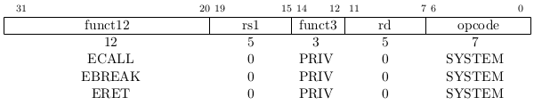
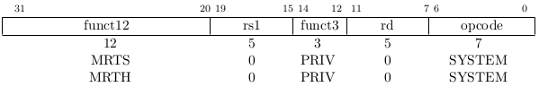
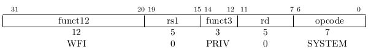

## 3.2 Machine-Mode Privileged Instructions

### 3.2.1 Instructions to Change Privilege Level

改变特权级别的指令由 PRIV 次操作码（minor opcode）进行编码。`ECALL`（Environment Call）和`EBREAK`（Environment Breakpoint）在所有特权级别都可用，而`ERET`（Environment Return）只在 S，H 和 M 特权级别可用。

使用 `ECALL` 指令请求更高的特权级别。The binary interface to the execution environment will define how parameters for the request are passed, but usually these will be in defined locations in the integer register file. 执行`ECALL`指令会引起一个 Environment Call execution。

`EBREAK` 指令被调试器用来把控制权转回给调试环境。执行`EBREAK`指令引起一个 Breakpoint execution。

处理完自陷之后，`ERET` 指令被用来返回出现该自陷的特权级别。除了 3.1.5节描述特权栈的操作之外，`ERET` 会把 `pc` 设置成存放在 Xepc 里的值，X 表示`ERET` 指令所在的特权模式（S，H 或者 M）。

### 3.2.2 Trap Redirection Instructions

`MRTS`(Machine Redirect Trap to Supervisor) 指令把 M-mode 的自陷处理委派给 S-mode。`MRTS` 把特权模式改成 S，并把 `pc` 设置成 supervisor 的存在 `stvec` 寄存器的自陷处理程序。此外，分别把 `mepc`，`mcause` 和 `mbadaddr` 寄存器的值复制到 `sepc`， `scause` 和 `sbadaddr` 寄存器。

`MRTH`(Machine Redirect Trap to Hypervisor) 指令的定义也是类似的，但把控制权转移给 H-mode 的 `htvec`。分别把 `mepc`，`mcause` 和 `mbadaddr` 寄存器的值复制到 `hepc`， `hcause` 和 `hbadaddr` 寄存器。

### 3.2.3 Wait for Interrupt

`WFI`(Wait for Interrupt) 指令给实现提供一个线索，当前的硬件线程被停顿，直到一个中断需要服务。`WFI` 指令的执行也被用来通知硬件平台合适的中断应该被路由到这个硬件线程。`WFI` 在 S，H 和 M 特权级别可用。

当硬件线程停顿时，若存在一个开启的中断或稍后会这样，该中断异常将发生在下条指令，也就是说，在处理自陷程序里恢复执行，`mepc = pc + 4`。

`WFI` 指令只是一个线索（hint），一个合法的实现应该实现 WFI 像 NOP 一样。

当`WFI` 指令被执行时，可以禁用中断，但如果任何中断（开启与否）待处理或当硬件线程停顿时变成待处理，该硬件线程必须恢复执行。如果任何屏蔽掉的中断是或者变成待处理的，将在 `pc+4` 恢复执行，且软件决定对任何待处理的中断采取何种措施。
