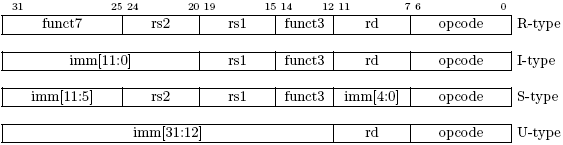

## 2.2 基本指令格式 ##

如图 2.2，基本 ISA 中有 4 种核心的指令格式（R / I / S / U）。四者的长度固定为 32 位，在内存中必须按字对齐。在取指令时，如果 pc 未按字对齐，会产生指令地址未对齐异常。

图 2.2: RISC-V 基本指令格式。

为了简化译码过程，RISC-V ISA 的所有指令格式中，源寄存器（rs1 和 rs2）和目的寄存器（rd）都在相同的位置。立即数被压缩在指令中最左边的可用位，并已经分配好，从而降低硬件复杂度。特别的是，对于所有的立即数，指令的 31 位总是符号位，这样可以加速有符号扩展电路。

<small>
寄存器描述符的译码过程通常位于实现方案的关键路径上，因此选择在指令格式上保持所有的寄存器描述符在相同位置，相应的代价是不得不在不同格式间移动立即数的位置（与 RISC-IV 也就是 SPUR[^12] 共有的特性）。

实际上，多数立即数不是很小就是需要整个 XLEN 长度的位宽。我们选择一种不对称的立即数分割方式（在常规指令中占 12 位，特殊的加载高位立即数指令 lui 中占 20 位）以增加常规指令可用的操作码空间。此外，ISA 中只提供有符号扩展立即数。对于一些立即苏，我们找不到使用零扩展的益处，我们希望 ISA 尽可能保持简单。
</small>

---

[^12]: David D. Lee, Shing I. Kong, Mark D. Hill, George S. Taylor, David A. Hodges, Randy H.
Katz, and David A. Patterson. A VLSI chip set for a multiprocessor workstation{Part I: An
RISC microprocessor with coprocessor interface and support for symbolic processing. IEEE
JSSC, 24(6):1688{1698, December 1989.