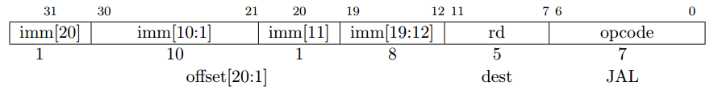
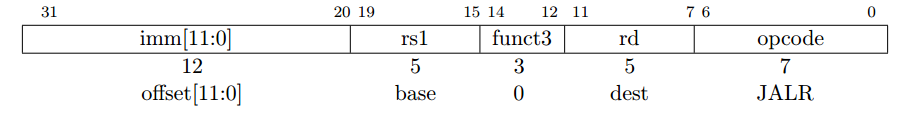
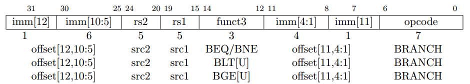

## 2.5 控制转移指令 ##

RV32I 提供两种控制转移指令：无条件跳转指令和条件分支指令。RV32I 的控制转移指令并没有结构上可见的延迟槽。

### 无条件跳转 ###
UJ 格式的 JAL 指令运用到 J 格式的立即数编码方式，符号位扩展之后 2 的整数倍的偏移量加上 pc 值作为跳转目标地址，因此可以控制指令跳转到当前位置前后 1 MiB 的范围内。JAL 指令将（pc + 4）存放在目的寄存器 rd 中。标准的软件中系统调用约定用寄存器 x1 作为返回地址寄存器。

当 JAL 的 rd = x0 的时候，即为简单的 jump 指令（汇编程序中的伪指令 J）。

用 I 格式编码的间接跳转指令 JALR（jump and link register），由寄存器 rs1 中的操作数加上 12 比特位的 I 格式的有符号立即数，然后把最小有效位设置为 0 来产生分支目标地址。把 jump 指令的下一地址（pc + 4）写入寄存器 rd。在不需要保存这个地址的时候，我们可以把目的寄存器设置为 x0。

> 所有的无条件跳转指令用 pc 相对寻址来为位置无关指令提供支持，JALR 指令可以使一个 2 条指令的指令序列实现在 32 比特位绝对地址空间范围内的任意位置的跳转。一个 LUI 指令可以先把目标地址的高 20 位放到 rs1 中，然后由 JALR 指令将它与低 20 位相加。同样的，AUIPC 后接 JALR 指令也可以实现 32 比特位 pc 相对寻址范围的任意地址跳转。

> 需要注意的是,JALR 指令不同于条件分支指令，它不以 2 字节的倍数的形式来处理立即数。这样避免了在硬件上有更多的立即数格式，同时也重用了全局 load 指令相同的重定位格式。实际上，大多数的 JALR 指令在使用的时候，要么是一个 0 立即数，要么跟 LUI 指令或者 AUIPC 指令成对出现，这样，稍微地减少跳转范围也不会对它造成很大的影响。

> JALR指令忽略了所计算出分支目标地址的最低比特位，这样既稍微地简化了硬件，又允许了函数指针的低比特位可以存放一些附加的信息。尽管这样在错误检测中会稍微有一些损失，而实际上跳到错误的指令地址会很快地引起异常。

> 返回地址预测栈是高性能取址单元所共有的特征。我们知道 rd 和 rs1 可以用来引导取址预测逻辑的实现，它们表征 JALR 指令应该增加（rd = x1），取出（rd = x0,rs1 = x1），或者是不去接触返回地址栈。相同的，一个 JAL 指令的 rd = x1 时也可以增加一个返回地址到返回地址栈中。

> 在 JALR 指令中，如果把基址 rs1 设置为 x0 的时候，它就可以实现一个地址空间在 ±2KiB 范围内的单个子程序调用。这样就可以用来实现调用一个小运行时间的库。

### 条件分支 ###

所有的分支指令都用 SB 格式进行编码。12 位的 B 格式的立即数以 2 的整数倍形式编码成有符号偏移量，加上当前的 pc 值作为分支目标地址。条件分支的范围是 ±4 KiB。

分支指令比较两个寄存器，BEQ 指令和 BNE 指令分别在寄存器 rs1 和 rs2 相等和不想等的时候进行分支，BLT 指令和 BLTU 指令分别对寄存器 rs1 和 rs2 进行有符号和无符号的比较，在 rs1 小于 rs2的时候进行分支。需要注意的是，BGT 指令，BGTU 指令，BLE 指令和 BLEU 指令分别可以通过颠倒 BLT 指令，BLTU 指令，BGE 指令和 BGEU 指令的操作数来实现。

软件应该被优化成大多数情况下是顺序执行代码，加上很少发生的分支跳转的代码序列。软件也应该至少在第一次遇到分支时假设向后的分支预测将会发生而向前的分支预测不发生。动态分支预测应该很快地获知任何可预测的分支行为。

不同于其他的一些体系结构，RISC-V 的 jump 指令（rd = x0 的 JAL 指令）作为一个无条件跳转指令而不是一个条件总是为真的条件分支指令。RISC-V 的 jump 指令也是 pc 相对寻址的，并且支持比 branch 指令更宽的跳转范围，这样并不会给有条件分支的分支预测表造成影响。

> 条件分支的设计包括算术比较两个寄存器中的操作数（在 PA-RISC 和 Xtensa ISA 中也是这样），而不是用条件码（x86,ARM,SPARC,PowerPC），或者是只用一个寄存器和 0 进行比较（Alpha,MIPS），或者是只比较两个寄存器是否相等（MIPS）。这样设计的动机是一个比较和分支相结合的指令刚好适合于一个有规律的流水线，这样避免了附加的条件码状态和一个临时寄存器的使用，减少了静态代码的大小和动态取指令的通信量。另外的一点是，同 0 比较需要一个有价值的线路延迟（尤其是发展到高级处理的静态逻辑之后），这样就会像算法量级的比较一样昂贵。融合分支和比较指令的另外一个优势在于，在前端的指令流中分支可以较早地展现，所以就可以较早地区进行预测。也许，条件码设计的一个优势在某些情况下可以基于同样的条件码而发生多个分支，但我们相信，这种情况是相对罕见的。

> 我们周详考虑过但是并没有顾及到在指令译码过程中的静态分支线索。这些可以减少动态预测的压力但是需要跟多的指令编码空间和对更好的结果的软件程序概要分析。如果实际的运行与概要分析的运行不匹配，就会导致更糟糕的性能。

> 我们周详考虑过但是并没有在指令中包含条件传送或者判断指令，它可以有效地取代不可预知的短分支。条件传送是两个里面比较简单的一个，但是用条件码就会比较困难，它可能会导致异常（内存访问和浮点操作）。判断指令需要在系统中增加额外的标记状态，增加指令去设置和清理这些标记，给每个指令增加额外的译码开销。条件传送和判断指令都要在乱序的微体系结构中增加复杂性。需要添加一个隐式的第三源操作数，因为如果预测失败，我们就要把结构的目的寄存器的原始值复制到重命名的物理的目的寄存器。另外，当输入不包括在编译器训练集，特别是考虑到不可预知的分支十分罕见，变得比分支预测技术的改善更加稀罕的时候，静态的编译时间决定了用判断来代替分支会导致性能更低。（这一段看不懂）

> 我们注意到，各种微体系结构中都存在着动态地把短向前分支转换成内部的判断代码，来避免当分支预测失败[7,11,10]时清空流水线所带来的损耗，并且已经在商用处理器上得以实现[20]。最简单的技术通过只清空分支后的指令来取代全部的流水线，或者通过宽的指令提取进行两边的取指，或者闲置指令提取槽技术，仅仅来减少短向前分支预测失败的补偿代价。更加复杂的乱序核技术在分支后的指令中添加内部的判断，这个内部的判断值由 branch 指令所写，它允许 branch 指令和接下来的指令在尊重其它代码[20]的条件下随机地无序地运行。（这一段不理解）
