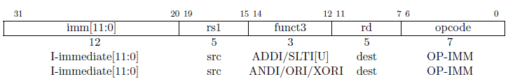
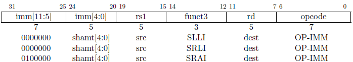
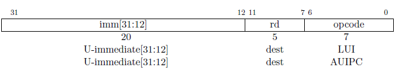
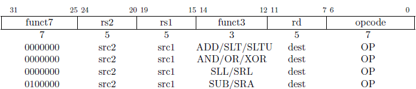
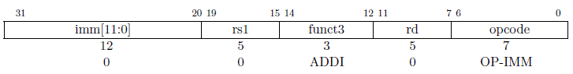

# 2.4 整型计算指令
大部分整型计算指令对保存在整型寄存器组（register file）里 XLEN 位的值进行运算。整型计算类的指令要么使用 I 格式编码来进行寄存器-立即数（register-immediate）运算，要么使用 R 格式编码来进行寄存器-寄存器（register-register)运算。寄存器-立即数和寄存器-寄存器两种类型的指令都使用寄存器 rd 存放目的操作数。整型计算类指令不会导致算术异常。

> 我们没有包含检测整型算术运算溢出的特殊指令集。大部分流行的编程语言不支持检测整型的溢出，一部分原因是大多数体系结构（architecture）是在程序运行时（runtime）检测整型算术的溢出，这需要付出很大的代价；另一部分原因是模运算（modulo arithmetic）有时是预期行为。

## 整型寄存器-立即数指令P

`ADDI` 把符号位扩展后的 12位立即数存到寄存器 rs1。算数溢出被忽略，只是简单地取计算结果的低 32位。 `ADDI rd, rs1, 0` 被用来实现 `MV rd, rs1` 汇编伪指令。

`SLTI`（set less than immediate）：当两个操作数都被看作是有符号数时，如果寄存器 rs1 的值小于符号位扩展后的立即数则将 rd 寄存器置 1，否则置 0。`STLIU` 跟 `SLTI` 相似，不过比较的数值视作无符号数（也就说，先符号位扩展立即数，然后在当作无符号数）。 **注意**，`SLTIU rd, rs1, 1` ，若 rs1 等于 0 ，rd 的值置为 1，否则为 0（汇编伪指令 `SEQZ rd, rs`）。

`ANDI`，`ORI`，`XORI` 是逻辑运算，对寄存器 rs1 和符号位扩展后的 12位立即数进行按位 **与** ， **或** ， **异或** 运算，把结果存到 rd 寄存器。 **注意：** `XORI rd, rs1, -1` 对寄存器 rs1 执行按位逻辑取反运算（汇编伪指令 `NOT rd, rs` ）。

移位量是常数的移位操作被编码成一种特殊的 I 格式。被移位的操作数存放在寄存器 rs1 上，移位量被编码在 I 型立即数的低五位字段里。右移的类型（算术或是逻辑）被编码在 I 型立即数的一个高位上（上图中看出是 `imm[10]`）。`SLLI` 是逻辑左移（低位补 0）；`SRLI` 是逻辑右移（高位补 0）；`SRAI` 是算术右移（高位补符号位）。

`LUI`（load upper immediate）被用来构建 32位常数，使用的是 U 型立即数。`LUI` 把 U 型立即数放到目的寄存器 rd 的高 20位上，低 12位补 0。

`AUIPC`（add upper immediate to pc）被用来构建 PC 相对的地址，使用的是 U `型立即数。AUIPC` 以低 12位补 0，高 20位是立即数的方式形成 32位偏移量，然后和 PC 相加，最后把结果保存在寄存器 rd。

> 对于控制流的转移（control-flow transfers）和访问数据，`AUIPC` 指令支持使用两条指令序列访问基于 PC 的任意偏移量（access arbitrary offsets from the PC）。 `AUIPC` 和 `JALR` 里的 12位立即数的组合，能够转移控制到任意的 32位 PC 相对地址（ `AUIPC` 先把 32位立即数的高 20位，补上低 12位全 0跟 PC 相加，把结果存到某个寄存器里， `JALR` 再把这个寄存器和 32位立即数的低 12位相加，跳转到相加得到的目标地址。也就是实现了 32位立即数加上 PC的目标地址），而 `AUIPC` 加上正常的（regular）取数和存数指令里的 12位偏移量，能访问任意的 32位 PC 相对数据地址（`AUIPC` 先把 32位立即数的高 20位，补上低 12位全 0跟 PC 相加，把结果存到某个寄存器里， 取数和存数指令再把这个寄存器和 32位立即数的低 12位相加，相加的结果为访问数据的目标地址。也就是实现了 32位立即数加上 PC的目标地址）。

> 获取当前 PC 的值可以通过（使用 `AUIPC` 指令并）把 U 型立即数置为全 0。尽管一个 `JAL+4` 指令也能用来获取当前 PC值，但这可能会导致在很简单的微体系结构里打断流水线（cause pipeline breaks），或是在更复杂的微体系结构里破坏（pollute）BTB 结构

## 整型寄存器-寄存器指令
RV32I 定义了几种算术 R格式的指令。所有指令读取源操作数寄存器 `rs1` 和 `rs2`，把运算结果写到寄存器 `rd`。 `funct7` 和 `funct3` 字段（这里的 7 和 3 表示字段的位数）选择运算类型。

`ADD` 和 `SUB` 分别执行加法和减法运算。忽略溢出并把结果的低 32位写到目的寄存器。 `SLT` 和 `SLTU` 分别执行有符号和无符号的比较，若 `rs1 < rs2` 则把 rd 置 1，否则置 0。 **注意：** `SLTU rd, x0, rs2` （x0 是 0号寄存器）若 rs2 不等于 0 把 rd 置 1，否则置 0（汇编伪指令 `SNEZ rd, rs` ）。 `AND` ， `OR` ， 和 `XOR` 执行按位逻辑操作。

`SLL` ， `SRL` 和 `SRA` 以寄存器 `rs2` 的低五位作为移位量，分别对寄存器 `rs1` 的值执行逻辑左移，逻辑右移和算术右移运算。

## NOP 指令

`NOP` 指令不会改变任何用户可见的状态，除了增加 PC（except for advancing the pc）。 `NOP` 被编码成 `ADDI x0, x0, 0` 。

> NOPs 可以被用来让代码片段在微体系结构上进行有效地址边界的对齐（align code segments to microarchitecturally significant address boundaries），或者留给修改内联（inline）代码的空间。尽管有多种编码 NOP 指令的方式，我们定义了标准的（canonical）NOP 编码格式，允许微体系结构的优化和使得反汇编输出更易读。
