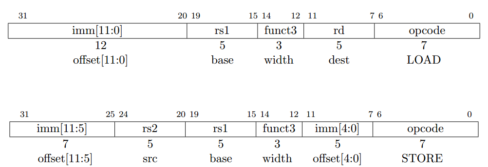

## 2.6 取数和存数指令 ##

RV32I 是 load-store 风格的体系结构，访问存储器只用 load 和 store 指令，算术指令只会对 CPU 寄存器进行运算。RV32I 提供按字节寻址和小端序的 32 位用户地址空间。执行环境将会定义哪部分的地址空间能合法访问。

load 和 store 指令在寄存器和存储器直接传输值。load 被编码成 I 格式指令， store 指令是 S 格式。有效的按字节寻址的地址（effective byte address）通过把寄存器 rs1 和 符号位扩展后的 12位偏移量相加获得。取数指令从存储器复制值到寄存器 rd，存数指令是把寄存器 rs2 的值复制到存储器。

LW 指令从存储器取 32 位值放到寄存器 rd。 LH 从存储器取 16位的值，然后符号位扩展成 32位后再存到寄存器 rd。 LHU 从存储器取 16位的值，然后零扩展成 32位后再存到寄存器 rd。 LB 和 LBU 类似地被定义成针对 8位的值。 SW，SH 和 SB 指令从寄存器 rs2 的低位取出 32 位，16 位和 8 位的值保存到存储器。

为了更好的性能，对于所有取数和存数指令的有效地址应该是自然地对每一种数据类型（也就是说，32位的访问是按四字节边界对齐，16位的访问是按两字节对齐）对齐。基本 ISA 支持非对齐的访问，但这可能会运行非常缓慢，这取决于具体实现。更进一步，自然地对齐的取数和存数保证原子性地执行，而非对齐的不会这样，因此（非对齐的)需要额外的同步来确保原子性。

<small>

当移植遗留的代码时偶尔需要到非对齐的访问，当使用任何形式的 packed-SIMD 扩展时，针对于很多应用程序，非对齐的访问是至关重要的。我们的对于借助规整的取数和装数指令来支持非对齐访问的基本原理，是为了简化添加非支持对齐的硬件。一个选项会不允许在基本的 ISA 非对齐的访问，然后提供一些支持非对齐访问的单独 ISA，要么是特殊的指令帮助软件处理非对齐访问，要么是针对非对齐访问的新硬件寻址模式。使用特殊的指令很困难，使 ISA 变得复杂，且经常会加入新的处理器状态（例如，SPARC VIS 对齐地址偏移量寄存器）或者使访问现有的处理器状态变得复杂（例如，MIPS LWL/LWR 写入部分寄存器）。除此之外，对于面向循环的（loop-oriented）packed-SIMD 代码，当操作数不对齐的额外开销促使软件根据操作数的对齐提供多种循环的形式，这就使得代码生成变得复杂和添加了循环启动的开销。新非对齐的硬件寻址模式采用相对大的指令编码空间或是需要非常简单的寻址模式（例如，只有间接的寄存器）。

我们不强制要求非对齐访问的原子性，这使得简单的实现能够只用一个机器自陷和软件处理程序（software handler）来处理非对齐访问。如果提供硬件支持非对齐访问，软件可以通过简单地使用普通的取数和存数指令来利用这个特性。硬件然后能自动地根据运行时访问是否对齐来优化访问。

</small>