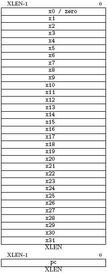

## 2.1 程序员可见的基本整型子集模型 ##

> 译者：范毅（[＠beyondskyml](https://github.com/beyondskyml)）

> 校对：咧威（[＠colin4124](https://github.com/colin4124)）

图 2.1 展示了基本整型子集中用户可见的状态。有 31 个用来保存整型值的通用寄存器 x1-x31 。寄存器 x0 硬连线成常数 0。虽然没有硬连线的子程序返回地址链接寄存器，但是根据标准软件调用协议，在一个子程序调用中应该使用寄存器 x1 来保存返回地址。对于 RV32，x 寄存器为 32 位宽，对于 RV64 则是 64 位宽。本文档使用 XLEN 指代当前 x 寄存器位宽（32 或者 64）。

还有一个用户可见的寄存器：程序计数器 PC，它保存当前指令地址。

> 可用的体系结构寄存器数量对于代码长度，性能和功耗都有很大影响。虽然可以证明 16 个寄存器对于整型 ISA 运行编译过的代码是足够的，但是对于使用 3 地址格式的 16 位指令（译者注：即一条指令包含三个操作数），想要编码有 16 个寄存器的完整 ISA 是不可能的。2 地址格式也许可行，但是会增加指令数量，降低效率。我们想避免中间的（intermediate）指令_长度_（比如 Xtensa 的 24 位指令）来简化基本硬件的实现方案，一旦采用 32 位指令长度，那么就直接支持 32 位整型寄存器。

> 对于基本 ISA，因为上述原因，以及现有代码在标准编译器上的表现，还有我们使用_自调整技术_（autotuning）产生高性能程序上的经验，我们给 32 个整型寄存器选择了一个惯用的长度（位宽）。少数经常访问的寄存器往往控制着动态的寄存器使用，在寄存器组的实现上进行优化，使得经常被访问寄存器的访问能耗降低。大部分可选的 16 位压缩指令格式只访问 8 个寄存器，因此可以提供稠密（译注：编码空间利用率高）的指令编码，然而，额外的指令集扩展能够支持所期望的更大的寄存器空间（扁平的或者层次化的）。

> 对于资源受限的嵌入式系统，可能去定义一个整型 RISC-V ISA 的非标准子集，包括有 16 个寄存器并使用现有指令编码，还需要对编译器和调用协议进行小幅修改。

图 2.1: RISC-V 用户级基本指令寄存器结构。
